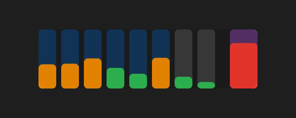

# statbar

macOS 菜单栏 CPU 和内存监控，纯 Mach 内核接口，零依赖。



## 安装

```sh
brew install beyond-infra/tap/statbar
```

或从源码：

```sh
make && make install
```

## 使用

安装后自动出现在菜单栏。蓝条 P 核心、灰条 E 核心，紫色内存条。悬停看详情，点击打开活动监视器。

## 贡献

欢迎提 PR 或开 issue。改动前先讨论。

## License

MIT，见 [LICENSE](LICENSE) 文件。
